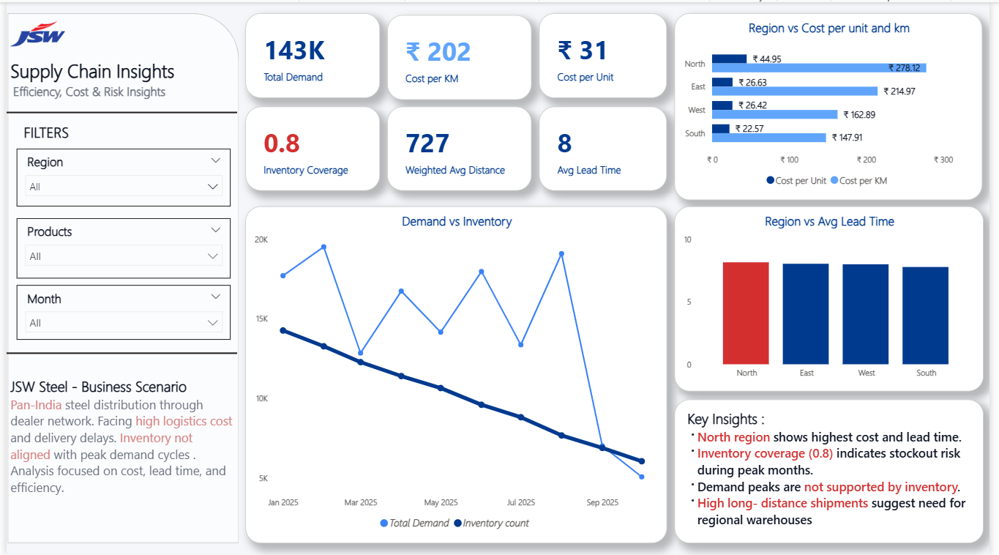
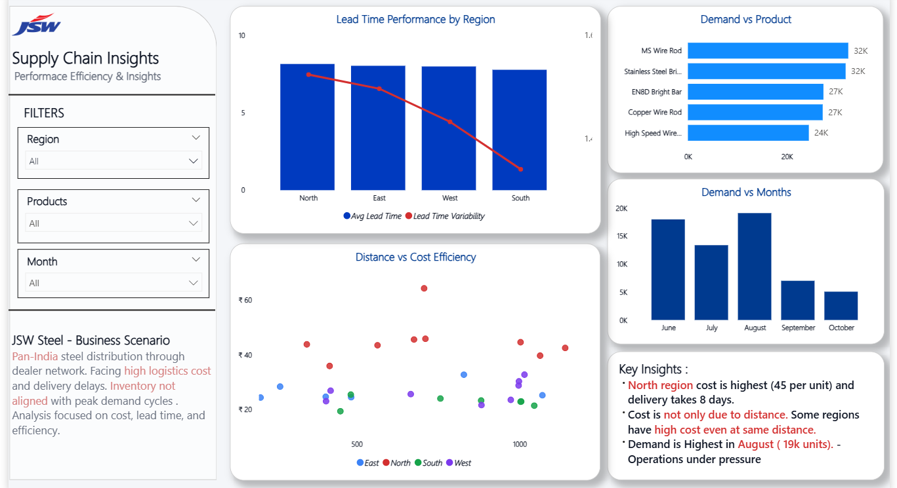
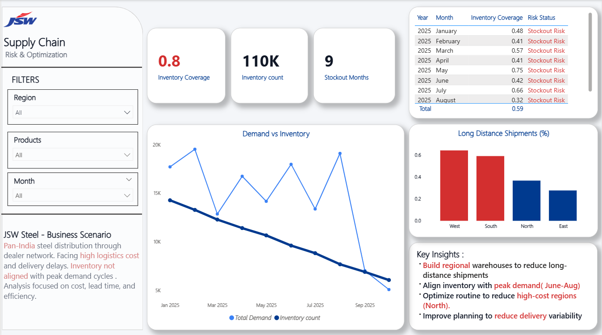

# Supply Chain End-to-End Analysis (SQL + Power BI)

## Business Scenario

JSW Steel operates a **pan-India distribution network** supplying products through dealers across multiple regions.
The business is experiencing **high logistics cost, delivery delays, and inventory imbalance**, impacting operational efficiency and customer service.

---

## Business Problem

The company lacks visibility into key supply chain inefficiencies:

* Logistics costs are increasing, but drivers are unclear
* Delivery timelines vary across regions, affecting reliability
* Inventory is not aligned with demand cycles, leading to stockout risks
* High dependency on long-distance shipments increases operational cost

Core Problem:
Inefficient supply chain planning is causing **higher cost, delayed deliveries, and risk of lost sales**

---

## Objective

To analyze supply chain data and identify:

* Cost inefficiencies across regions
* Lead time delays and variability
* Demand vs inventory mismatch
* Opportunities to optimize logistics and inventory planning

---

## Project Approach

### 1. Data Analysis (SQL)

* Extracted and analyzed supply chain data
* Calculated KPIs: demand, cost per unit, lead time, inventory coverage
* Identified regional and product-level performance gaps

### 2. Data Visualization (Power BI)

* Built interactive dashboard for business monitoring
* Compared regional performance (cost, lead time, distance)
* Visualized demand vs inventory trends
* Highlighted supply chain risks and inefficiencies

---

## Key Insights

* **North region drives highest logistics cost (₹45/unit)** and has longer delivery time
* **Inventory coverage at 0.8** indicates consistent stockout risk
* **Demand peaks are not supported by inventory**, leading to supply-demand mismatch
* **High long-distance shipments (West & South)** increase cost and inefficiency
* Cost variation exists even at similar distances → indicates **operational inefficiency**

---

## Business Impact

This analysis helps the business:

* Identify **cost leakage areas in logistics operations**
* Detect **regions causing delays and inefficiencies**
* Reduce **stockout risk and improve service level**
* Enable **data-driven decision making in supply chain planning**

**Potential Impact:**

* Reduce logistics cost
* Improve delivery performance
* Increase customer satisfaction
* Minimize revenue loss due to stockouts

---

## Recommendations

* Establish **regional warehouses** to reduce long-distance shipments
* Align inventory planning with **peak demand (June–August)**
* Optimize routes to reduce **cost variation across regions**
* Improve planning to reduce **lead time variability**

---

## Tools Used

* SQL (Data Analysis)
* Power BI (Dashboard & Visualization)
* Excel (Data Preparation)

---

## Project Outcome

Developed an **end-to-end supply chain analysis solution** combining SQL and Power BI to uncover operational inefficiencies and provide actionable business recommendations.

---

## Dashboard Preview

### Page 1 – Overview

### Page 2 – Performance Analysis

### Page 3 – Risk & Optimization

